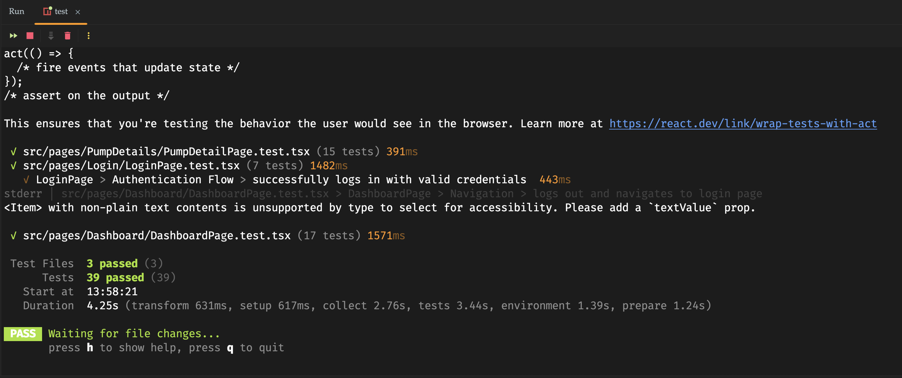

# PumpMaster Web Application

A modern web application for managing agricultural irrigation pumps across multiple locations. Built with React, TypeScript, and designed for seamless integration with a C# Web API backend.

## 🌐 Live Demo

**[View Live Application →](https://pump-master-wine.vercel.app/)**

Experience the application with demo credentials:
- **Username:** demo
- **Password:** demo123

## 🎥 Application Demo


*The demo showcases the complete user flow: login, dashboard navigation, pump management, search/filter functionality, and detailed pump views with maps and charts.*

## 🧪 Test Results



The application includes comprehensive unit tests for all major components:
- **39 Tests** covering authentication, CRUD operations, search/filter, navigation, and error handling
- **3 Test Suites** for LoginPage, DashboardPage, and PumpDetailPage
- **100% Pass Rate** ensuring code reliability
- Tests written using Vitest and React Testing Library following best practices

## 🚀 Quick Start

### Prerequisites
- Node.js (v18.16.0 or higher)
- npm (v9.8.1 or higher)

### Installation & Setup

1. Clone the repository:
```bash
git clone [repository-url]
cd PumpMasterWebApp
```

2. Install dependencies:
```bash
npm install
```

3. Create environment configuration:
```bash
# Create a .env file in the root directory
echo "VITE_USE_MOCK=true" > .env
```

4. Start the development server:
```bash
npm run dev
```

5. Open your browser and navigate to:
```
http://localhost:5173
```

### Demo Credentials
- **Username:** demo
- **Password:** demo123

## 🛠️ Technology Stack

### Frontend Technologies
- **React 18.3** - Modern UI library for building interactive interfaces
- **TypeScript 5.7** - Type-safe JavaScript for better developer experience
- **Vite 5.4** - Lightning-fast build tool and development server
- **HeroUI** - Modern React component library for consistent UI
- **Tailwind CSS 3.4** - Utility-first CSS framework for rapid styling

### Key Libraries
- **React Router v6** - Client-side routing and navigation
- **React Hook Form** - Performant forms with easy validation
- **Axios** - HTTP client for API communication
- **React Leaflet** - Interactive maps for pump location visualization
- **Recharts** - Beautiful charts for pressure data visualization
- **Lucide React** - Modern icon library
- **date-fns** - Date formatting and manipulation
- **react-hot-toast** - Toast notifications for user feedback

## 📁 Project Structure

```
src/
├── components/          # Reusable UI components
│   ├── common/         # Shared components (Spinner, StatusBadge, etc.)
│   └── pumps/          # Pump-specific components (forms, modals)
├── pages/              # Page components
│   ├── LoginPage.tsx   # Authentication page
│   ├── DashboardPage.tsx # Main pump listing and management
│   └── PumpDetailPage.tsx # Individual pump details with map/charts
├── services/           # Business logic and API integration
│   ├── api/           # API client and endpoints
│   ├── authService.ts # Authentication logic
│   ├── mockPumpService.ts # Mock data layer
│   └── pumpService.ts # Unified pump service interface
├── types/             # TypeScript type definitions
└── utils/             # Utility functions and mock data
```

## 🌟 Key Features

### Authentication System
- JWT-based authentication ready for production
- Session persistence with localStorage
- Protected routes with automatic redirects
- Token refresh mechanism (demonstrated in API client)

### Pump Management
- **Dashboard View**: Table listing of all pumps with key metrics
- **Search & Filter**: Real-time search across pump names, areas, and types
- **CRUD Operations**: Create, Read, Update pumps (Delete ready but not exposed in UI)
- **Status Indicators**: Visual status badges (Operational, Warning, Error, Maintenance)

### Pump Details
- **Comprehensive Information**: All pump attributes displayed clearly
- **Interactive Map**: Leaflet integration showing exact pump locations
- **Pressure Charts**: 24-hour pressure trend visualization
- **Responsive Design**: Clean, professional UI that works on all screen sizes

### Data Visualization
- **Map Integration**: Each pump plotted on Australian agricultural regions
- **Real-time Charts**: Pressure data displayed with Recharts
- **Status Overview**: Color-coded status indicators for quick assessment

## 🔄 Mock Service & Backend Integration

The application is architected for easy transition between mock data and real backend:

### Mock Mode (Default)
- Uses localStorage for data persistence
- Simulates network delays for realistic UX
- Pre-populated with 10 demo pumps across Australian locations
- Perfect for demonstrations and development

### Production Mode
The application is fully prepared for C# Web API integration:

#### API Client Features
- **Automatic token management**: JWT Bearer token injection
- **Request/Response transformation**: camelCase ↔ PascalCase conversion
- **Error handling**: Comprehensive HTTP error management
- **Token refresh**: Automatic token refresh on 401 responses
- **Request tracking**: Correlation IDs for debugging

#### Expected Backend Endpoints
```
GET    /api/pumps          # List all pumps with pagination
GET    /api/pumps/{id}     # Get single pump details
POST   /api/pumps          # Create new pump
PUT    /api/pumps/{id}     # Update existing pump
DELETE /api/pumps/{id}     # Delete pump (ready but not in UI)
GET    /api/pumps/statistics # Pump statistics
GET    /api/pumps/export   # Export pump data
```

### Switching Between Modes
Simply update the `.env` file:
```bash
# For mock mode (default)
VITE_USE_MOCK=true

# For production mode
VITE_USE_MOCK=false
VITE_API_URL=https://your-api-endpoint.com
```

## 🏗️ Architecture Highlights

### Service Layer Pattern
- Unified interface (`pumpService.ts`) abstracts data source
- Easy switch between mock and real API via environment variables
- Consistent API regardless of data source

### Type Safety
- Full TypeScript coverage
- Strict type definitions for all data models
- Type-safe forms with React Hook Form

### Error Handling
- Global error boundary for React errors
- Toast notifications for user feedback
- Comprehensive API error handling
- Loading states throughout the application

### Performance Optimizations
- Lazy loading with React Suspense (ready to implement)
- Optimized re-renders with React.memo
- Efficient form handling with React Hook Form
- Debounced search functionality

## 🚀 Production Deployment

### Build for Production
```bash
npm run build
```

### Preview Production Build
```bash
npm run preview
```

### Deployment Options
- **Vercel**: Zero-config deployment (recommended)
- **Netlify**: Simple drag-and-drop deployment
- **Azure Static Web Apps**: Integrated with C# backend
- **Docker**: Containerized deployment

## 🔧 Development Commands

```bash
npm run dev      # Start development server
npm run build    # Build for production
npm run preview  # Preview production build
npm run lint     # Run ESLint
npm run type-check # Run TypeScript compiler
npm test         # Run unit tests
npm run test:ui  # Run tests with UI
npm run test:coverage # Generate test coverage report
```

## 📝 Notes for Backend Integration

When connecting to the C# backend:

1. **Update Environment Variables**: Set `VITE_USE_MOCK=false` and provide the API URL
2. **CORS Configuration**: Ensure the C# backend allows requests from the frontend domain
3. **Authentication**: Implement the `/auth/login` and `/auth/refresh` endpoints
4. **Data Models**: The frontend expects the DTOs shown in `src/services/api/pumpApi.ts`

## 🎯 Future Enhancements

The application is structured to easily add:
- Real-time updates with SignalR
- Advanced filtering and sorting
- Bulk operations
- Export functionality
- Mobile responsive design
- Dark mode support
- Internationalization

## 📧 Contact

For any questions or clarifications about the implementation, please feel free to reach out.

---

**Note**: This application demonstrates modern React development practices, enterprise-level architecture patterns, and production-ready code organization suitable for integration with existing backend systems.
